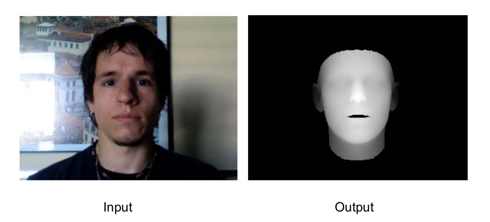

# Deep Learning based Face Anti-Spoofing

Aim: Using auxiliary supervision to detect spoofs in face recognition systems.

Team members: [Arshdeep Singh](https://iamarshsingh.github.io/), [Pranav Mahajan](https://pranavmahajan25.github.io/portfolio/)

Mentors: [Dr. Sanjay Singh](https://www.ceeri.res.in/profiles/sanjay-singh/), 
[Mr. Sumeet Saurav](https://www.ceeri.res.in/profiles/sumeet-saurav/), 
[Mr. Shyam Sundar](https://www.ceeri.res.in/profiles/shyam/)

This work was done as Summer Research Internship @ Cyber Physical Systems Department, CSIR-CEERI, Pilani, Rajasthan, India.

## Overview

Facial anti-spoofing is the task of preventing false facial verification by using a photo, video, mask or a different substitute for an authorized person's face. We can try to classify all spoofs (including unknown or zero-shot) up to 13 categories. 

Most commonly known presentation attacks are:

- Print Attack: Showing a picture of the person to the camera.
- Replay Attack: Playing a video of the person.
- Mask Attack: Wearing a 3-D printed mask of the victim. 

Various end-to-end binary classification models fit to arbitrary cues like screen bezel etc. instead of more faithful features like skin detail loss, colour distortion and shape deformation. Thus by using auxiliary supervision, we can nudge the model to learn explainable spatial and temporal information.

We are building deep learning models to estimate depth maps for understanding spatial information and estimate rPPG signals for understanding temporal information.

Example of How Depth Estimation works:

rPPG signals are remote polyplethysmographic signals that correspond to blood flow through our vessels and can be estimated using various techniques as they show high correlation with intensity changes.

## Progress & further work

- Currently we have a working depth-estimator model which we wish improve upon.
- We are also working on rPPG estimator model try different domain adaptation techniques.
- Eventually we wish to do extensive intra and inter database testing with varied input frame length.
